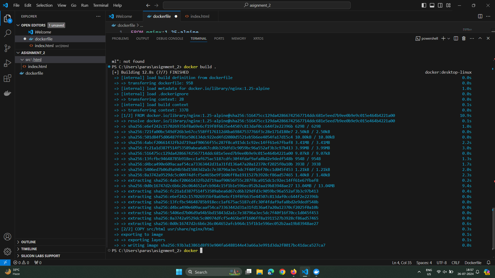
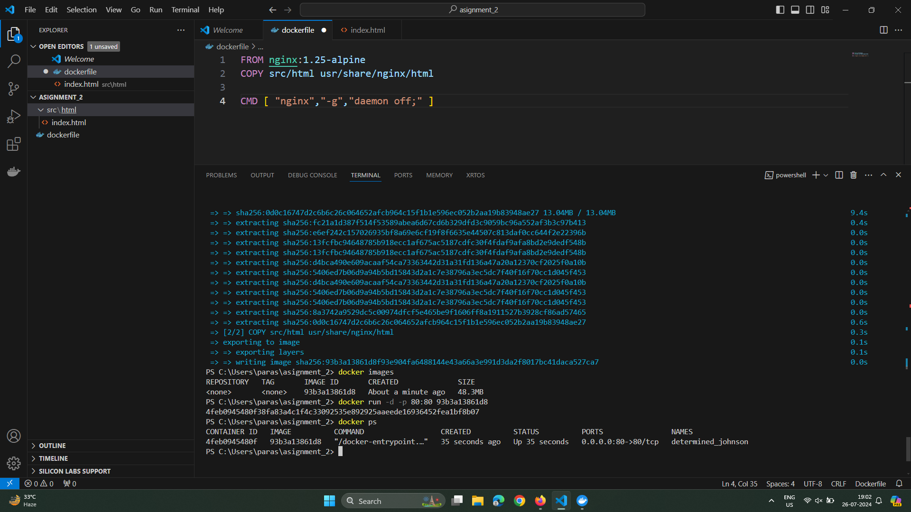
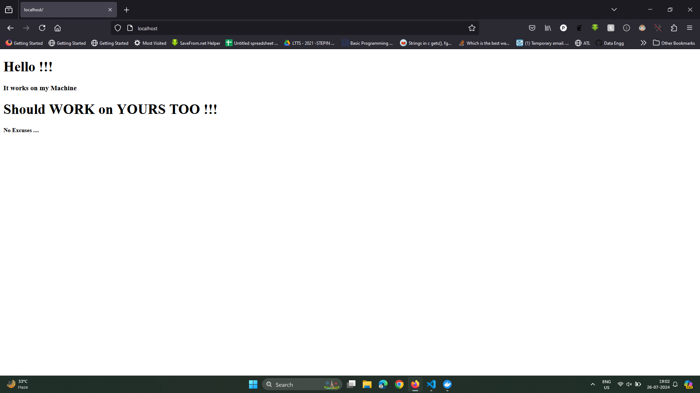
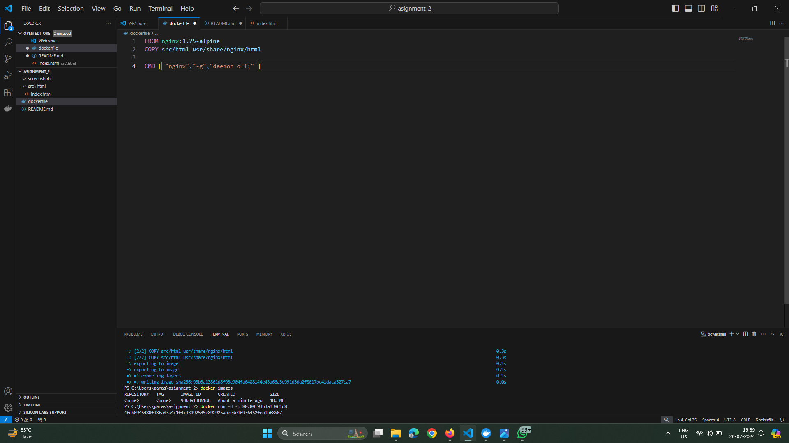

# IIT-Jodhpur Assignment

**About the Project**

This project is part of the assignment, demonstrating creating a docker image from scratch containing a sample web application.


### Building the Docker Image
```
docker build -t my_image -f dockerfile .
```
**Running the Container**
```
docker run -d -p 80:80 my_image
```
**Accessing**

Open any browser and logon to:
``` 
localhost
```

**Installed Packages**
* nginx


**For Troubleshooting**

You may also see the following commands for troubleshooting if everything went correctly or not. 

```
docker images
docker ps
docker ps -a
```

## Screenshots










